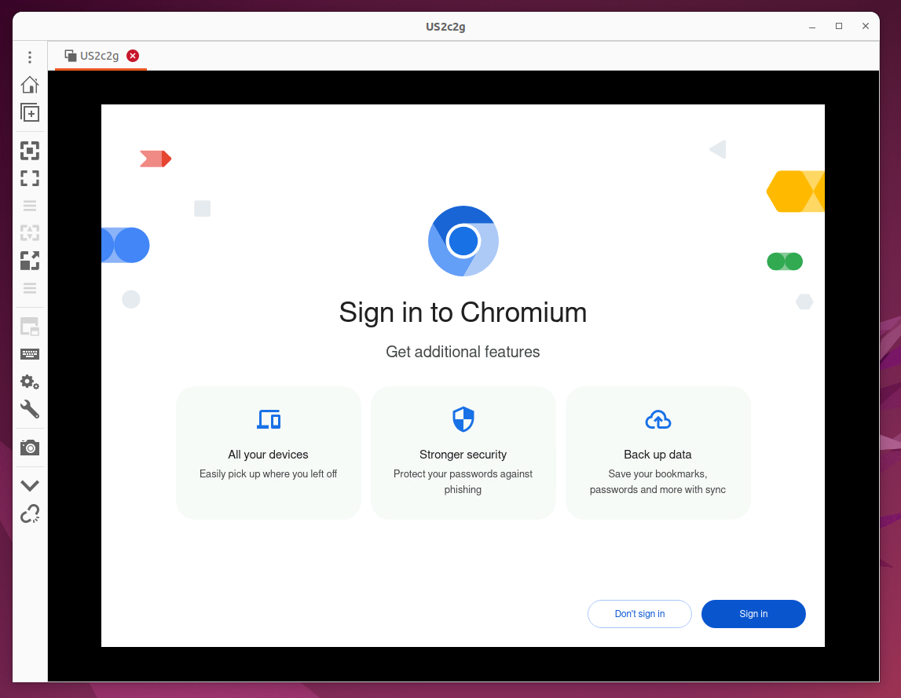

# Browser-VNC Docker 容器

这个项目提供了一个 Docker 化的环境，通过使用 noVNC 运行基于 Web 的 VNC 客户端，允许通过 VNC 连接访问 Chromium 浏览器。容器基于 Alpine Linux 构建，包含 Xvfb、x11vnc、fluxbox 和 supervisor 等必要组件来管理进程。





## 快速使用

使用以下命令运行 Docker 容器：

```sh
docker run -d \
	   -p 5900:5900 \
	   -p 6080:6080 \
	   -v ~/chrome-data:/data \
	   -e VNC_PASSWORD=yourpassword \
	   --name browservnc \
	   kechangdev/browser-vnc
```

- `-p 5900:5900`: 映射 VNC 服务器端口。
- `-p 6080:6080`: 映射 noVNC 网页客户端端口。
- `-v ~/chrome-data:/data`: 挂载一个卷用于持久化 Chromium 用户数据。
- `-e VNC_PASSWORD=yourpassword`: 设置 VNC 密码。
- `--name browservnc`: 命名容器实例。
- `kechangdev/browser-vnc`: 使用指定的 Docker 镜像。

## 访问浏览器

1. **VNC 客户端**：使用 VNC 客户端连接 `localhost:5900`，密码为设置的 `VNC_PASSWORD`。
2. **网页浏览器**：打开网页浏览器，导航到 `http://localhost:6080`，通过 noVNC 访问 VNC 服务器。

## 项目结构

项目由三个主要文件构成：

### Dockerfile

`Dockerfile` 用于构建 Docker 镜像，配置所有必要组件：

- **基础镜像**：使用 `alpine:latest` 作为轻量级基础镜像。
- **构建阶段**：安装 `wget`、`curl` 和 `unzip`，然后下载并解压 noVNC 和 websockify。
- **主要阶段**：
  - 安装 Chromium、Xvfb、x11vnc、fluxbox、ttf-freefont 和 supervisor。
  - 从构建阶段复制 noVNC 文件。
  - 复制 `supervisord.conf` 文件用于进程管理。
  - 复制并设置 `start.sh` 脚本的执行权限。
  - 暴露端口 5900（VNC）和 6080（noVNC）。
  - 设置默认命令为运行 `start.sh`。

```dockerfile
FROM alpine:latest AS builder

RUN apk add --no-cache \
    wget \
    curl \
    unzip

RUN mkdir -p /opt/noVNC/utils/websockify \
    && wget -qO- https://github.com/novnc/noVNC/archive/v1.3.0.tar.gz | tar xz --strip 1 -C /opt/noVNC \
    && wget -qO- https://github.com/novnc/websockify/archive/v0.9.0.tar.gz | tar xz --strip 1 -C /opt/noVNC/utils/websockify

FROM alpine:latest

COPY --from=builder /opt/noVNC /opt/noVNC

RUN apk add --no-cache \
    chromium \
    xvfb \
    x11vnc \
    fluxbox \
    ttf-freefont \
    supervisor

COPY supervisord.conf /etc/supervisor/conf.d/supervisord.conf

COPY start.sh /start.sh
RUN chmod +x /start.sh

EXPOSE 5900 6080

CMD ["/start.sh"]
```

### supervisord.conf

`supervisord.conf` 文件配置 Supervisor 以管理多个服务：

- **Xvfb**：设置虚拟帧缓冲器以启用离屏渲染。
- **x11vnc**：启动 VNC 服务器以允许远程连接。
- **fluxbox**：运行窗口管理器。
- **chromium**：启动带有远程调试的 Chromium 浏览器。
- **noVNC**：提供基于 Web 的 VNC 客户端。

```ini
[supervisord]
nodaemon=true

[program:Xvfb]
command=/usr/bin/Xvfb :99 -screen 0 1024x768x16
autostart=true
autorestart=true
stdout_logfile=/var/log/xvfb.log
stderr_logfile=/var/log/xvfb_error.log

[program:x11vnc]
command=/usr/bin/x11vnc -forever -usepw -display :99 -rfbport 5900
autostart=true
autorestart=true
stdout_logfile=/var/log/x11vnc.log
stderr_logfile=/var/log/x11vnc_error.log

[program:fluxbox]
command=/usr/bin/fluxbox
autostart=true
autorestart=true
stdout_logfile=/var/log/fluxbox.log
stderr_logfile=/var/log/fluxbox_error.log

[program:chrome]
command=/usr/bin/chromium-browser --no-sandbox --disable-dev-shm-usage --remote-debugging-port=9222 --user-data-dir=/data --display=:99
autostart=true
autorestart=true
stdout_logfile=/var/log/chrome.log
stderr_logfile=/var/log/chrome_error.log

[program:noVNC]
command=/opt/noVNC/utils/novnc_proxy --vnc localhost:5900 --listen 6080
directory=/opt/noVNC
autostart=true
autorestart=true
stdout_logfile=/var/log/novnc.log
stderr_logfile=/var/log/novnc_error.log
```

### start.sh

`start.sh` 脚本初始化 VNC 密码并启动 Supervisor：

- **VNC 密码**：从 `VNC_PASSWORD` 环境变量设置 VNC 密码（默认：1234）。
- **Supervisor**：启动 Supervisor 以管理配置的服务。

```sh
#!/bin/sh
  
if [ -z "$VNC_PASSWORD" ]; then
    echo "VNC_PASSWORD is 1234"
    VNC_PASSWORD=1234
fi

mkdir -p ~/.vnc
x11vnc -storepasswd $VNC_PASSWORD ~/.vnc/passwd

/usr/bin/supervisord -c /etc/supervisor/conf.d/supervisord.conf
```

这种设置提供了一个轻量级且方便的环境，以通过 VNC 远程运行和交互 Chromium 浏览器。
